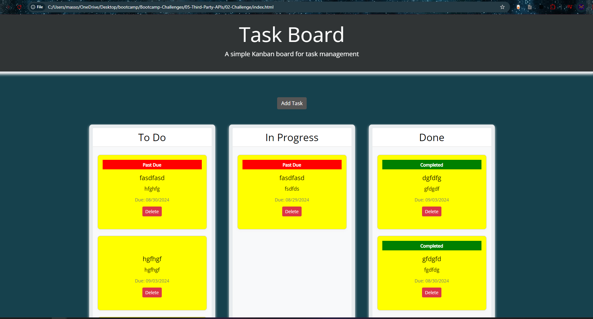

# Kanban Task Board

A simple, interactive Kanban board for task management built using HTML, CSS, JavaScript, and jQuery. This application allows users to create, update, move, and delete tasks between different columns ("To Do", "In Progress", "Done"). The tasks are stored in `localStorage` so that they persist across sessions.

## Features

- **Add Tasks**: Users can add new tasks with a title, description, and deadline.
- **Drag-and-Drop**: Tasks can be dragged and dropped between columns to reflect their current status.
- **Task Duplication Prevention**: The application automatically checks for and prevents duplicate tasks based on title, description, and deadline.
- **Task Deletion**: Users can delete tasks when they are no longer needed.
- **Local Storage**: All tasks are stored in `localStorage`, ensuring that the task list persists even after the page is refreshed.

## Installation

### Prerequisites

- A web browser with JavaScript enabled.

### Steps

1. **Clone the repository**:
    ```bash
    git clone https://github.com/yourusername/kanban-task-board.git
    ```
2. **Navigate to the project directory**:
    ```bash
    cd kanban-task-board
    ```
3. **Open `index.html` in your web browser**:
    - Double-click the `index.html` file.
    - Alternatively, right-click the file and select "Open with" and choose your web browser.

## Usage

1. **Adding a Task**:
   - Click the "Add Task" button.
   - Fill in the title, description, and deadline.
   - Click "Save" to add the task to the "To Do" column.

2. **Moving Tasks**:
   - Drag tasks from one column to another (e.g., from "To Do" to "In Progress").
   - The task status will update automatically based on the column it is moved to.

3. **Deleting Tasks**:
   - Click the "Delete" button on a task to remove it from the board.

4. **Preventing Duplicates**:
   - The system will automatically prevent tasks with the same title, description, and deadline from being duplicated when moved or added.

## File Structure

```plaintext
kanban-task-board/
│
├── assets/
│   ├── css/
│   │   └── style.css           # Custom styles for the Kanban board
│   └── js/
│       └── script.js           # Main JavaScript logic for the Kanban board
│
├── index.html                   # Main HTML file
└── README.md                    # Project documentation (this file)

